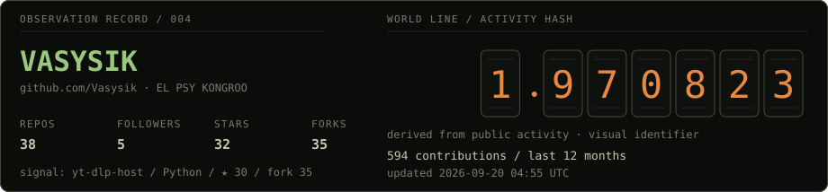
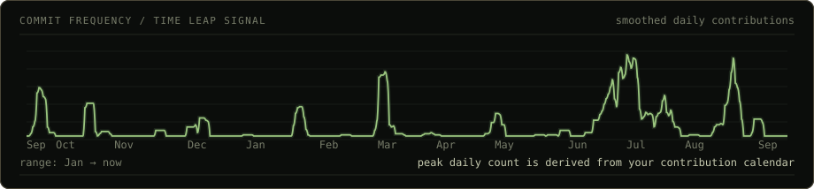
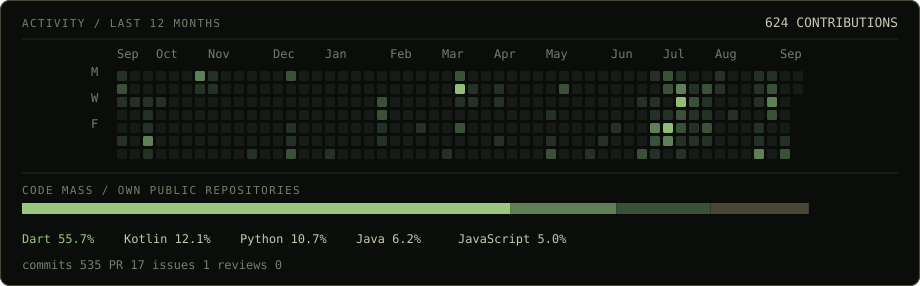

<picture>
  <source media="(prefers-color-scheme: dark)" srcset="./assets/generated/hero-dark.svg">
  <source media="(prefers-color-scheme: light)" srcset="./assets/generated/hero-light.svg">
  
</picture>

 

<picture>
  <source media="(prefers-color-scheme: dark)" srcset="./assets/generated/wave-dark.svg">
  <source media="(prefers-color-scheme: light)" srcset="./assets/generated/wave-light.svg">
  
</picture>

 

<picture>
  <source media="(prefers-color-scheme: dark)" srcset="./assets/generated/activity-dark.svg">
  <source media="(prefers-color-scheme: light)" srcset="./assets/generated/activity-light.svg">
  
</picture>
